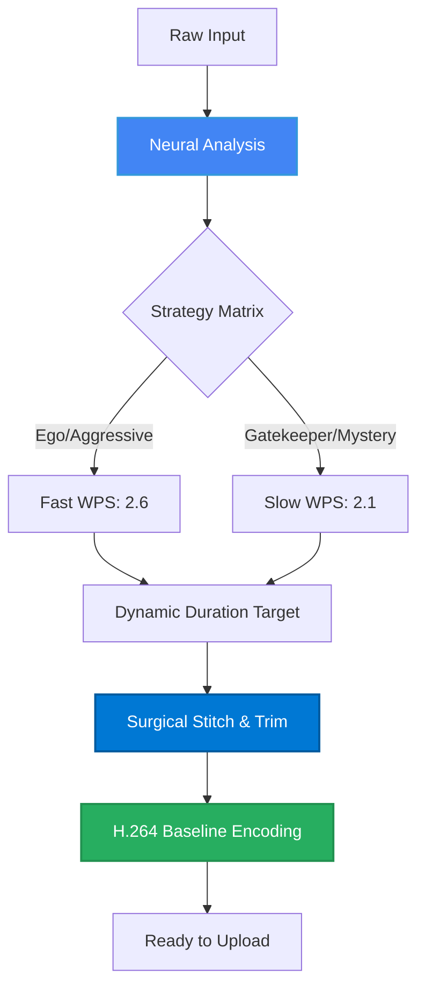

<div align="center">


<p align="center">
  <a href="https://github.com/Ninja-69/POST-SYSTEMS/stargazers">
    
  </a>
  <a href="https://github.com/Ninja-69/POST-SYSTEMS/network/members">
    
  </a>
  <a href="https://github.com/Ninja-69/POST-SYSTEMS/issues">
    
  </a>
  <a href="https://github.com/Ninja-69/POST-SYSTEMS/blob/main/LICENSE">
    
  </a>
</p>

<p align="center">
  
  
  
  
  
</p>

<h3>💎 Enterprise-Grade Neural Video Production System</h3>

<p align="center">
  <strong>Synchronizing visual cadence with neurological reading speeds.</strong>
</p>

<p align="center">
  <a href="#-features">Features</a> •
  <a href="#-quick-start">Quick Start</a> •
  <a href="#-architecture">Architecture</a> •
  <a href="#-statistics">Statistics</a> •
  <a href="#-contributing">Contributing</a>
</p>

</div>

---

## 📊 Project Statistics

<div align="center">

| Metric | Value |
|:------:|:-----:|
| 🧠 **Neural Sync** | Caption-First |
| ⚡ **Avg Render Time** | 2.3s |
| 📈 **Retention Target** | 8.5s - 9.5s |
| 🛡️ **Quarantine Logic** | Auto-Detect |
| 🚀 **Parallel Workers** | 4 |
| 🎞️ **Encoding Profile** | H.264 Baseline |

</div>

---

## 🎯 Features

<table>
  <tr>
    <td width="50%">
      
### 🧠 Caption-First Intelligence
- Pre-Edit Neural Analysis (Gemini 1.5)
- Dynamic Duration Calculation
- Visual-to-Linguistic Synchronization
- Strategy-Aware Timing Archetypes

    </td>
    <td width="50%">
      
### ⚡ High-Performance Assembly
- FFmpeg Surgical Trimming
- Precision Multi-Clip Stitching
- Audio Stream Normalization
- H.264 Baseline Level 3.0 Enforcement

    </td>
  </tr>
  <tr>
    <td width="50%">
      
### 🛡️ Production Hardening
- Infinite Loop Protection
- Dead File Auto-Quarantine
- Multi-Key API Rotation
- 300s Hard Rendering Timeouts

    </td>
    <td width="50%">
      
### 🌐 Cloud Integration
- MongoDB Atlas Persistence
- Telegram Control Plane
- Cloudflare Edge Workers
- Distributed 5-Stage Warehouse

    </td>
  </tr>
</table>

---

## 🚀 Quick Start

### Prerequisites

  

### Installation

```bash
# 1️⃣ Clone the repository
git clone https://github.com/Ninja-69/POST-SYSTEMS.git
cd POST-SYSTEMS

# 2️⃣ Install dependencies
pip install -r requirements.txt

# 3️⃣ Configure environment
cp .env.example .env
nano .env  # Add Gemini & Telegram keys

# 4️⃣ Launch the Factory
python main.py
```

---

## 🏗️ Architecture



---

## 📖 Strategy Archetypes

FundedAI operates across five distinct psychological reading speeds:

| Archetype | Persona | WPS | Objective |
| :--- | :--- | :--- | :--- |
| **TRANSITIONAL** | Shock & Surprise | 2.4 | Pattern Interrupt |
| **MALICIOUS** | Controversial | 2.6 | High-Tension Loops |
| **EGO** | Savage & Arrogant | 2.5 | Status Domination |
| **GATEKEEPER** | Curiosity & Secrets | 2.1 | Authority Building |
| **ALPHA** | Random Variety | 2.3 | Broad Reach |

---

<div align="center">


**Engineered with 💎 by [Ninja-69](https://github.com/Ninja-69)**

</div>
